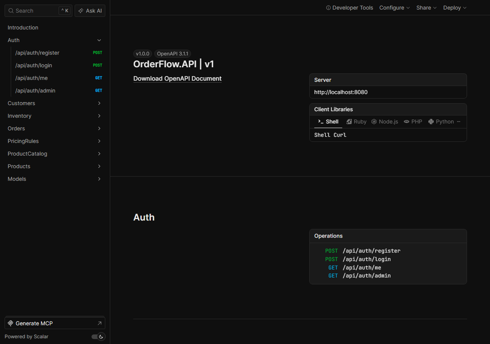

# OrderFlow


Order management backend in **ASP.NET Core 10 + C#**: customers, product
catalog, inventory reservations that cannot oversell, tiered pricing,
order workflows, email notifications, and external accounting invoicing —
built with Clean Architecture, CQRS, and 180+ automated tests.



## Features

- JWT authentication with `Admin` / `SalesEmployee` / `Customer` roles and
  resource-ownership enforcement.
- Customer management with activation state and pricing tiers.
- Product catalog with search, pagination, and per-product inventory.
- Orders with atomic stock reservation and
  `Submitted → Confirmed → Processing → Completed` workflow.
- Optimistic-concurrency inventory (parallel orders for the last units
  cannot oversell; loser gets `409 Conflict`).
- Customer-specific pricing rules with validity windows and price snapshots.
- Transactional outbox + Hangfire: email notifications and idempotent
  accounting synchronization with retries.
- Correlation IDs, structured JSON logs, readiness/liveness probes.

## Tech stack

ASP.NET Core, EF Core (SQL Server / SQLite in tests), Identity + JWT,
MediatR, FluentValidation, Hangfire, MailKit, Serilog, xUnit,
FluentAssertions, NSubstitute, Coverlet, Docker, GitHub Actions.

## Run it

```powershell
Copy-Item .env.example .env   # fill in SA_PASSWORD, JWT_SECRET_KEY, ADMIN_PASSWORD
docker compose up --build -d
# http://localhost:8080/health/ready → Healthy; Scalar docs at /scalar/v1
```

Or locally with .NET 10 SDK (`dotnet run --project src/OrderFlow.API`,
SQL Server connection in `appsettings.Development.json`).

## API

Scalar reference at `/scalar/v1` (Development). A Postman collection with
auth flow, environment variables, and request examples for every area
lives in [`postman/`](postman/).

## Documentation

- [`docs/overview.md`](docs/overview.md) — business problem, features, repo map
- [`docs/architecture/architecture.md`](docs/architecture/architecture.md) — layers, CQRS, flows
- [`docs/architecture/adr/`](docs/architecture/adr/) — 8 architecture decision records
- [`docs/database/database-design.md`](docs/database/database-design.md) — tables + ERD
- [`docs/authentication/authentication.md`](docs/authentication/authentication.md) — auth & endpoint matrix
- [`docs/testing/test-strategy.md`](docs/testing/test-strategy.md) — test layers and doubles
- [`docs/docker/docker-setup.md`](docs/docker/docker-setup.md) — container environment
- [`docs/cicd/deployment.md`](docs/cicd/deployment.md) — pipeline and deployment
- [`docs/roadmap.md`](docs/roadmap.md) — future improvements
- Feature docs: `customers/`, `products/`, `inventory/`, `orders/`,
  `pricing/`, `accounting/`, `notifications/`, `observability/`

## Project structure

```text
src/OrderFlow.Api/  src/OrderFlow.Application/  src/OrderFlow.Domain/
src/OrderFlow.Infrastructure/  src/OrderFlow.FakeAccountingApi/
tests/OrderFlow.Tests/  tests/OrderFlow.IntegrationTests/
```

## Quality gates

`dotnet test OrderFlow.slnx` (unit + integration, green), CI builds,
tests, containerizes, and smoke-deploys every change on `master`.
