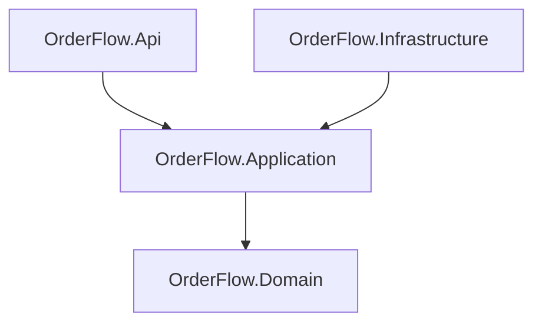
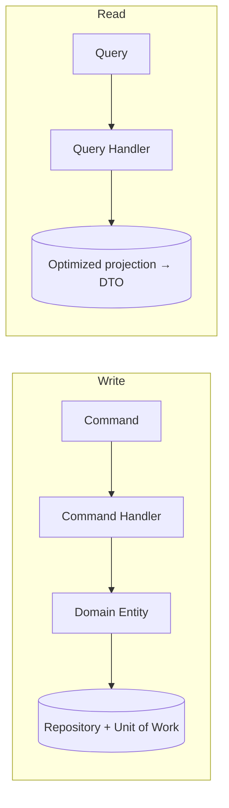
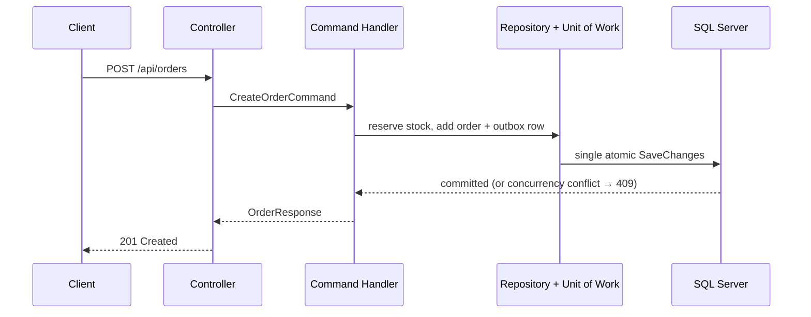

# Architecture

OrderFlow follows **Clean Architecture** with **CQRS**, the **Repository
Pattern**, and the **Unit of Work Pattern** (rationale: `adr/001-clean-architecture.md`).

## Dependency direction

The Domain layer has no dependencies on infrastructure or frameworks.
Application defines repository and unit-of-work interfaces; Infrastructure
implements them. Controllers are thin: they translate HTTP into MediatR
commands/queries and never touch the database.

## CQRS

Writes and reads are separate responsibilities against one SQL Server
database (no event sourcing, no read store):

- **Commands** mutate state through domain entities, persist via
  repositories, and commit once through the unit of work
  (e.g. `CreateCustomerCommand`, `CreateOrderCommand`).
- **Queries** are read-only, use `AsNoTracking()`, project directly to DTOs,
  and paginate in the database (e.g. `GetCatalogProductsQuery`).
- Each command/query with its handler and validator lives in a dedicated
  use-case folder (`Commands/CreateProduct/`, `Queries/GetProducts/`).

## Write and read flows

The order-creation save persists the order, its inventory reservations, and
the notification outbox row atomically; Hangfire later delivers the outbox
messages (notifications, accounting sync) with at-least-once semantics.

## Cross-cutting concerns

- **Auth**: Identity + JWT, role checks on controllers, ownership checks for
  customer-private data (`docs/authentication/authentication.md`).
- **Validation**: FluentValidation on commands/queries before handlers run.
- **Errors**: `Result<T>` with typed errors → Problem Details; unhandled
  exceptions map to status codes with a `traceId`.
- **Observability**: correlation IDs, structured Serilog logs, readiness and
  liveness probes (`docs/observability/observability.md`).

Related: `cqrs-and-repository.md`, `adr/` (all decisions).
