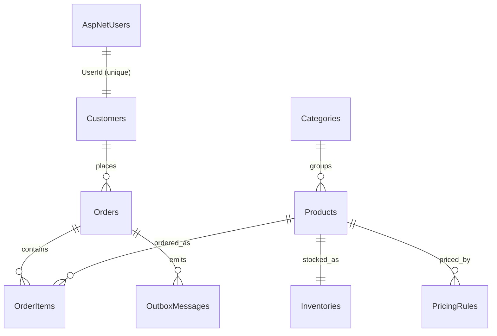

# Database Design

Single SQL Server database, Code First via EF Core configurations in
`OrderFlow.Infrastructure/Persistence/Configurations/`. Production applies
migrations at startup; tests use `EnsureCreatedAsync` on SQLite.

## Entity-relationship diagram

## Tables

- **AspNetUsers / AspNetRoles** (Identity) — credentials, `FullName`,
  role membership. `Customers.UserId` is a unique FK with cascade delete.
- **Customers** — phone, address, `IsActive`, `Tier` (string), timestamps.
  Unique index on `UserId`.
- **Categories** — unique name; `Restrict` delete while products reference it.
- **Products** — name, description, SKU (unique, normalized uppercase),
  price, `IsActive`, timestamps. Supporting index `(IsActive, Name)` for
  catalog browse; see `docs/products/catalog-performance.md`.
- **Inventories** — one row per product (unique `ProductId`, cascade
  delete): `Quantity`, `ReservedQuantity`, and `Version`, an
  application-managed optimistic-concurrency token. `AvailableQuantity` is
  computed (`Quantity - ReservedQuantity`) and never stored.
- **Orders** — `CustomerId` (`Restrict` delete), `Status` and
  `AccountingSyncStatus` (strings), `ExternalInvoiceId`, sync attempt
  counters. `TotalAmount` is computed from items, not stored.
- **OrderItems** — `OrderId` (cascade), `ProductId`, quantity, snapshotted
  `UnitPrice`/`LineTotal` so price history survives rule changes.
- **PricingRules** — `ProductId`, `Tier`, `DiscountPercentage`,
  `ValidFromUtc`/`ValidToUtc`. Index `(ProductId, Tier, ValidFromUtc)`.
- **OutboxMessages** — transactional outbox: message type, JSON payload,
  `OrderId`, creation/processing timestamps, Hangfire job id, attempts.

## Key design choices

- Money (`Price`, `UnitPrice`, `LineTotal`) uses `decimal(18,2)`.
- Enums (`Status`, `Tier`, sync status) persist as short strings for
  readable data and logs.
- No inventory or order total is ever stored redundantly; derived values
  are computed in the domain or projected in queries.
- Delete behavior protects history: customers with orders and categories
  with products cannot be cascade-deleted; order items and inventory die
  with their parent.
